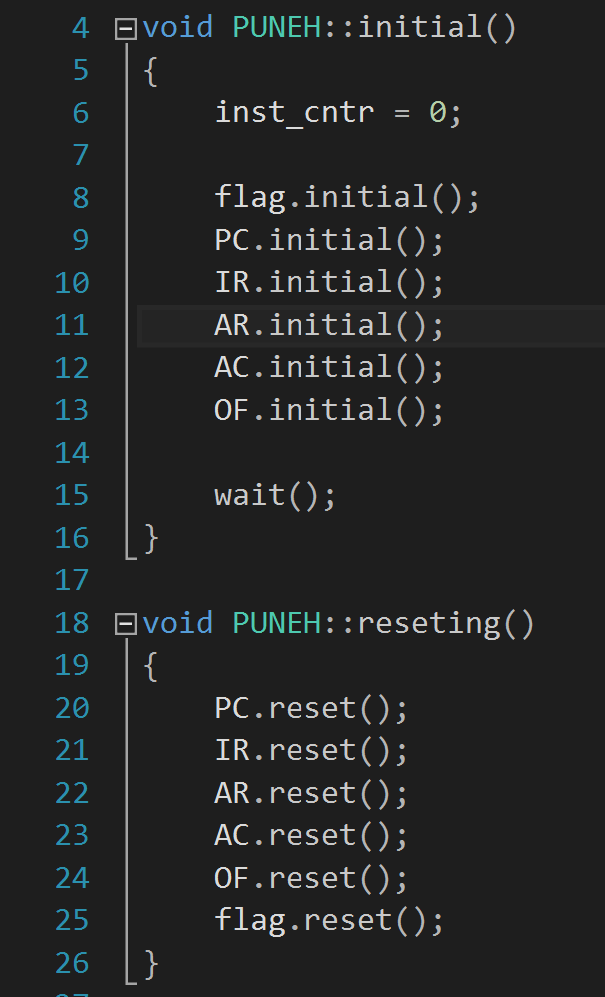
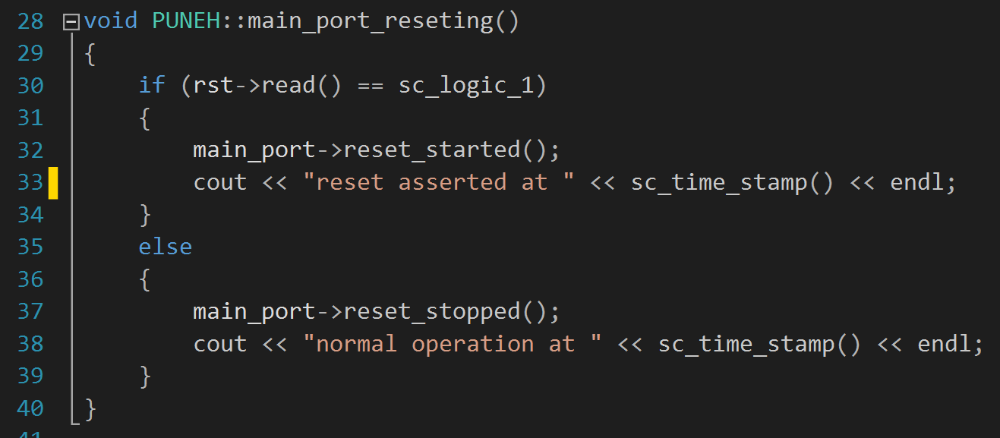
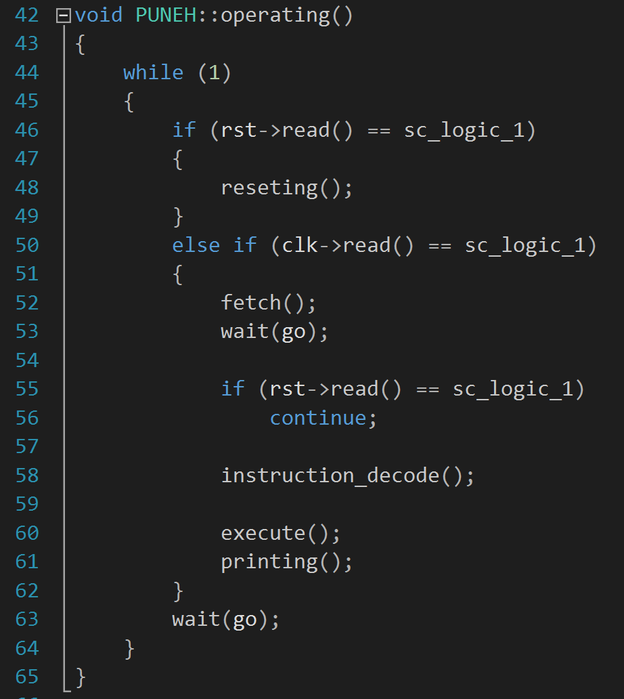

# PUNEH Simple Processor ISS

## Description

This repository contains a SystemC instruction-set simulator for the PUNEH
simple 16-bit processor. The model includes:

- the CPU core and instruction decode/execute pipeline
- a shared bus/channel abstraction
- a TLM memory subsystem
- a register file
- a UART/USART peripheral model
- interrupt handling and semihosting-style intercepts

The code also boots a small demo program in simulated memory. That program
computes a sequence, stores intermediate values, and prints values through the
`PAC` instruction path.

The hardware RTL for PUNEH lives in the upstream project:

https://github.com/malisaber/PUNEH-simple-processor/tree/main

## Repository Layout

- `include/` - public headers for the simulator
- `src/` - SystemC/TLM implementation files and the `sc_main` entry point
- `docs/images/` - screenshots from the original project
- `docs/presentation/` - the original presentation material
- `artifacts/` - generated logs and other non-source leftovers

## Screenshots







## Guide

## Build

The provided `Makefile` uses `vcpkg` to fetch SystemC on Windows and builds the
simulator into `bin/puneh-iss.exe`.

```powershell
make install-deps
make
make run
```

If you already have SystemC installed somewhere else, you can point the build
at it by setting `SYSTEMC_ROOT` before invoking `make`.

## What the model does

At a high level, the simulator:

- fetches instructions from memory
- decodes full-address and no-address opcodes
- updates the accumulator, flags, program counter, and operand register
- reads and writes memory-mapped peripherals
- services interrupts by saving state in the register file area
- supports semihosting-style instruction interception for selected opcodes

The built-in demo program in `src/memory.cpp` initializes a sequence and prints
values during execution so you can see the processor state evolve.

## Notes

- Generated logs are ignored by default.
- The repo is now arranged in a conventional source/include layout so it is
  easier to browse on GitHub and easier to hook into CI later.
